# AI Call Center System - Architecture Diagram

## System Architecture Overview

### Swimlane Architecture Diagram

```mermaid
graph TB
    subgraph "User Layer"
        U[👤 User - Hearing Impaired]
        U1[📱 Mobile User]
        U2[💻 Desktop User]
    end

    subgraph "Frontend Layer (Next.js)"
        F1[🎨 UI Components]
        F2[🔊 Audio Processing]
        F3[📡 API Client]
        F4[💾 State Management]
        
        F1 --> F2
        F2 --> F3
        F3 --> F4
    end

    subgraph "API Gateway Layer"
        AG1[🌐 CORS Middleware]
        AG2[📁 Static Files]
        AG3[🔒 Security]
        
        AG1 --> AG2
        AG2 --> AG3
    end

    subgraph "Backend Layer (FastAPI)"
        B1[💬 Chat Service]
        B2[🎤 Speech Service]
        B3[📞 Call Service]
        B4[🧠 AI Integration]
        B5[📚 Knowledge Base]
        
        B1 --> B4
        B2 --> B4
        B3 --> B4
        B4 --> B5
    end

    subgraph "AI Models Layer"
        AI1[🎯 Typhoon2 TTS]
        AI2[🔍 Emotion Detection]
        AI3[📝 Text Processing]
        
        AI1 --> AI2
        AI2 --> AI3
    end

    subgraph "Data Layer"
        D1[💾 PostgreSQL]
        D2[🎵 Audio Storage]
        D3[📋 Session Store]
        D4[🔍 Cache Layer]
        
        D1 --> D2
        D2 --> D3
        D3 --> D4
    end

    subgraph "Infrastructure Layer"
        I1[🐳 Docker Containers]
        I2[⚖️ Load Balancer]
        I3[📊 Monitoring]
        I4[🔐 SSL/TLS]
        
        I1 --> I2
        I2 --> I3
        I3 --> I4
    end

    %% User interactions
    U --> F1
    U1 --> F1
    U2 --> F1
    
    %% Frontend to API Gateway
    F3 --> AG1
    
    %% API Gateway to Backend
    AG3 --> B1
    AG3 --> B2
    AG3 --> B3
    
    %% Backend to AI Models
    B4 --> AI1
    B4 --> AI2
    B4 --> AI3
    
    %% Backend to Data
    B1 --> D1
    B2 --> D2
    B3 --> D3
    B5 --> D1
    
    %% Infrastructure connections
    I1 --> B1
    I1 --> B2
    I1 --> B3
    I2 --> AG1
    I4 --> AG1

    %% Styling
    classDef userLayer fill:#e1f5fe,stroke:#01579b,stroke-width:2px
    classDef frontendLayer fill:#f3e5f5,stroke:#4a148c,stroke-width:2px
    classDef apiLayer fill:#e8f5e8,stroke:#1b5e20,stroke-width:2px
    classDef backendLayer fill:#fff3e0,stroke:#e65100,stroke-width:2px
    classDef aiLayer fill:#fce4ec,stroke:#880e4f,stroke-width:2px
    classDef dataLayer fill:#e0f2f1,stroke:#004d40,stroke-width:2px
    classDef infraLayer fill:#f1f8e9,stroke:#33691e,stroke-width:2px

    class U,U1,U2 userLayer
    class F1,F2,F3,F4 frontendLayer
    class AG1,AG2,AG3 apiLayer
    class B1,B2,B3,B4,B5 backendLayer
    class AI1,AI2,AI3 aiLayer
    class D1,D2,D3,D4 dataLayer
    class I1,I2,I3,I4 infraLayer
```

## Detailed Component Architecture

### Frontend Components Flow

```mermaid
graph LR
    subgraph "Frontend Components"
        P[📄 Page.tsx]
        CM[💬 ChatMessage]
        ST[🎤 SpeechToText]
        TC[📞 TwoWayCall]
        SB[🔘 SuggestionButtons]
        HM[✏️ HITLModal]
        
        P --> CM
        P --> ST
        P --> TC
        P --> SB
        P --> HM
    end
    
    subgraph "State Management"
        S1[📝 Messages State]
        S2[🎵 Audio State]
        S3[🔍 Suggestions State]
        S4[📱 UI State]
        
        P --> S1
        P --> S2
        P --> S3
        P --> S4
    end
    
    subgraph "API Integration"
        API[🌐 API Client]
        CH[💬 Chat API]
        SP[🎤 Speech API]
        CL[📞 Call API]
        
        API --> CH
        API --> SP
        API --> CL
    end
    
    CM --> API
    ST --> API
    TC --> API
    SB --> API
    HM --> API
```

### Backend Services Flow

```mermaid
graph TB
    subgraph "FastAPI Application"
        APP[🚀 Main App]
        MW[🔒 Middleware]
        RT[🛣️ Routes]
        
        APP --> MW
        MW --> RT
    end
    
    subgraph "Core Services"
        CS1[💬 Chat Service]
        CS2[🎤 Speech Service]
        CS3[📞 Call Service]
        CS4[👤 User Service]
        
        RT --> CS1
        RT --> CS2
        RT --> CS3
        RT --> CS4
    end
    
    subgraph "AI Integration"
        TTS[🎯 Typhoon2 TTS]
        ED[🔍 Emotion Detection]
        KB[📚 Knowledge Base]
        
        CS1 --> TTS
        CS1 --> ED
        CS1 --> KB
        CS2 --> TTS
        CS3 --> TTS
    end
    
    subgraph "Data Processing"
        DP1[🎵 Audio Processing]
        DP2[📝 Text Processing]
        DP3[💾 File Management]
        
        TTS --> DP1
        ED --> DP2
        CS2 --> DP3
    end
```

### Data Flow Architecture

### Deployment Architecture

```mermaid
graph TB
    subgraph "Production Environment"
        LB[⚖️ Load Balancer]
        
        subgraph "Frontend Cluster"
            F1[🌐 Frontend 1]
            F2[🌐 Frontend 2]
            F3[🌐 Frontend 3]
        end
        
        subgraph "Backend Cluster"
            B1[🔧 Backend 1]
            B2[🔧 Backend 2]
            B3[🔧 Backend 3]
        end
        
        subgraph "AI Models Cluster"
            AI1[🧠 AI Model 1]
            AI2[🧠 AI Model 2]
        end
        
        subgraph "Database Cluster"
            DB1[💾 Primary DB]
            DB2[💾 Replica DB]
            CACHE[🔥 Redis Cache]
        end
        
        LB --> F1
        LB --> F2
        LB --> F3
        
        F1 --> B1
        F2 --> B2
        F3 --> B3
        
        B1 --> AI1
        B2 --> AI2
        B3 --> AI1
        
        B1 --> DB1
        B2 --> DB2
        B3 --> CACHE
    end
```

## Technology Stack

### Frontend
- **Framework**: Next.js 14 with TypeScript
- **UI Library**: React 18
- **Styling**: Tailwind CSS
- **State Management**: React Hooks + Context API
- **Audio Processing**: Web Audio API, MediaRecorder

### Backend
- **Framework**: FastAPI (Python)
- **AI Models**: Typhoon2-Audio for TTS
- **Audio Processing**: soundfile, numpy, wave
- **API Documentation**: OpenAPI/Swagger
- **CORS**: Configurable origins

### Infrastructure
- **Containerization**: Docker + Docker Compose
- **GPU Support**: NVIDIA CUDA runtime
- **Static Files**: FastAPI StaticFiles
- **Environment**: Configurable via environment variables

### Data Storage
- **Database**: PostgreSQL (planned)
- **File Storage**: Local file system
- **Caching**: In-memory + Redis (planned)
- **Session Management**: Local storage + server-side

## Security Features

- **CORS Protection**: Configurable allowed origins
- **File Upload Validation**: Audio file type checking
- **Input Sanitization**: Text input validation
- **Audio Processing**: Secure local processing
- **API Rate Limiting**: Planned implementation

## Performance Characteristics

- **TTS Generation**: < 2 seconds per sentence
- **API Response**: < 500ms average
- **Audio Quality**: 16kHz, 16-bit WAV format
- **Real-time Processing**: WebSocket support (planned)
- **Scalability**: Horizontal scaling ready

## Monitoring & Observability

- **Health Checks**: `/health` endpoint
- **Performance Metrics**: Response time tracking
- **Error Handling**: Comprehensive error responses
- **Logging**: Structured logging (planned)
- **Metrics**: Prometheus integration (planned)

